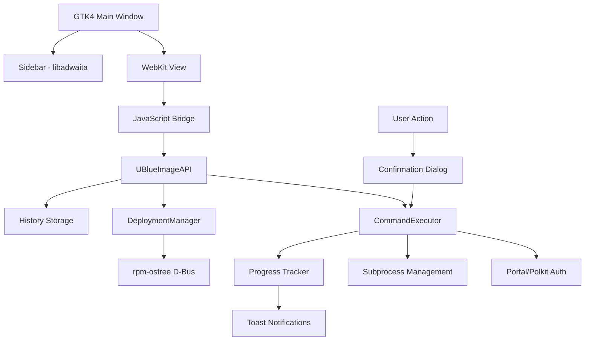

# Universal Blue Rebase Tool - Design Document

## Overview
This design extends the existing Universal Blue Image Manager application to support direct command execution with user confirmation, while maintaining the security and architectural patterns already established. The application will retain its hybrid GTK4/WebKit architecture and portal-first security model, adding new capabilities for rebase execution and deployment rollback management.

## Code Reuse Analysis

### Components to Extend:
1. **UBlueImageAPI Class** - Extend with execution methods while keeping existing structure
2. **WebKit JavaScript Bridge** - Add new API methods for command execution
3. **Adw.ToastOverlay** - Reuse for operation status notifications
4. **Portal Integration** - Extend for polkit authentication
5. **Threading Infrastructure** - Use existing pattern for async command execution

### New Components Required:
1. **CommandExecutor** - Service for safe command execution with progress tracking
2. **ConfirmationDialog** - libadwaita dialog for operation confirmation
3. **DeploymentManager** - Service to parse and manage rpm-ostree deployments
4. **ProgressTracker** - Real-time command output display component

## Architecture



## Components and Interfaces

### Component 1: CommandExecutor
- **Purpose:** Safely execute system commands with proper authentication and progress tracking
- **Interfaces:**
  - `execute_with_confirmation(command, warning_text)` - Show confirmation and execute
  - `execute_with_progress(command, callback)` - Execute with real-time output
  - `request_elevated_privileges()` - Handle polkit authentication
- **Dependencies:** subprocess, threading, Gtk.Dialog, Portal APIs
- **Reuses:** Existing threading patterns from UBlueImageAPI

### Component 2: DeploymentManager
- **Purpose:** Parse and manage rpm-ostree deployment information
- **Interfaces:**
  - `get_all_deployments()` - Return list of available deployments
  - `get_current_deployment()` - Get currently booted deployment
  - `format_deployment_info(deployment)` - Format deployment for display
  - `generate_rollback_command(deployment_id)` - Create rollback command
- **Dependencies:** rpm-ostree D-Bus interface, json
- **Reuses:** Existing rpm-ostree status parsing logic

### Component 3: ConfirmationDialog (libadwaita)
- **Purpose:** Display operation details and safety warnings before execution
- **Interfaces:**
  - `show_rebase_confirmation(image_name, command)` - Rebase confirmation
  - `show_rollback_confirmation(deployment_info, command)` - Rollback confirmation
  - `get_user_response()` - Return user's decision
- **Dependencies:** Adw.MessageDialog, Gtk.TextView
- **Reuses:** libadwaita styling and patterns

### Component 4: ProgressTracker
- **Purpose:** Display real-time command output in the web interface
- **Interfaces:**
  - `start_tracking(operation_name)` - Initialize progress display
  - `update_output(line)` - Add output line to display
  - `complete(success, message)` - Mark operation complete
- **Dependencies:** WebKit JavaScript injection, GLib.idle_add
- **Reuses:** Existing JavaScript bridge communication

### Component 5: HistoryManager
- **Purpose:** Store and retrieve command execution history
- **Interfaces:**
  - `add_entry(command, timestamp, success)` - Add history entry
  - `get_recent_entries(limit=50)` - Retrieve recent history
  - `prune_old_entries()` - Remove entries beyond limit
- **Dependencies:** json, os.path, GLib directories
- **Reuses:** Application data directory structure

## Data Models

### Deployment
```python
class Deployment:
    id: str              # Deployment checksum
    origin: str          # Image URL
    version: str         # OS version
    timestamp: str       # Deployment date
    is_booted: bool      # Currently active
    is_pinned: bool      # Pinned status
    index: int           # Deployment index
```

### HistoryEntry
```python
class HistoryEntry:
    command: str         # Executed command
    timestamp: datetime  # Execution time
    success: bool        # Operation result
    image_name: str      # Target image (if rebase)
    operation_type: str  # 'rebase' or 'rollback'
```

### OperationConfirmation
```python
class OperationConfirmation:
    title: str           # Dialog title
    description: str     # Operation description
    command: str         # Command to execute
    warnings: List[str]  # Safety warnings
    require_restart: bool # System restart needed
```

## Error Handling

### Authentication Errors
- **Scenario:** Polkit authentication fails or is cancelled
- **Response:** Show error toast, log attempt, return to ready state
- **User Feedback:** "Authentication required to perform this operation"

### Command Execution Errors
- **Scenario:** rpm-ostree command fails
- **Response:** Display error output in progress tracker, show error toast
- **User Feedback:** Full error message with suggestions

### System Compatibility Errors
- **Scenario:** Operation attempted on non-rpm-ostree system
- **Response:** Disable execution buttons, show informational message
- **User Feedback:** "This operation requires an rpm-ostree-based system"

### Network Errors
- **Scenario:** Cannot reach container registry for rebase
- **Response:** Show network error details, suggest checking connection
- **User Feedback:** "Unable to reach image registry. Check your network connection."

## Security Considerations

### Privilege Escalation
- Use XDG Desktop Portal for authentication when available
- Fall back to polkit for system operations
- Never store credentials or bypass authentication

### Command Injection Prevention
- Validate all image URLs against allowed registries
- Use subprocess with list arguments (no shell=True)
- Sanitize all user inputs before command construction

### Audit Trail
- Log all executed commands with timestamps
- Store operation results for accountability
- Implement read-only access to history

## Testing Strategy

### Unit Tests
- **CommandExecutor:** Mock subprocess calls, test error handling
- **DeploymentManager:** Test parsing of various rpm-ostree status formats
- **HistoryManager:** Test storage limits and pruning
- **Reuses:** Existing test infrastructure and patterns

### Integration Tests
- Test full flow from selection to execution
- Verify portal/polkit authentication flow
- Test error scenarios and recovery
- **Reuses:** Existing WebKit bridge testing setup

### UI Tests
- Verify confirmation dialogs display correct information
- Test responsive layout behavior
- Ensure accessibility compliance
- **Reuses:** Existing GTK4 testing utilities

## Implementation Notes

### WebKit Bridge Extensions
```javascript
// Extend existing bridge with new methods
window.ublueImageAPI = {
    ...existingMethods,
    executeRebase: function(imageUrl) {
        webkit.messageHandlers.ublueAPI.postMessage({
            method: 'execute_rebase',
            args: [imageUrl]
        });
    },
    executeRollback: function(deploymentId) {
        webkit.messageHandlers.ublueAPI.postMessage({
            method: 'execute_rollback',
            args: [deploymentId]
        });
    },
    getDeployments: function() {
        webkit.messageHandlers.ublueAPI.postMessage({
            method: 'get_deployments'
        });
    }
};
```

### Progress Display Integration
The progress tracker will inject JavaScript to update the web interface in real-time:
```python
def update_progress(self, line):
    js_script = f"""
    if (typeof updateProgress === 'function') {{
        updateProgress({json.dumps({'line': line, 'timestamp': time.time()})});
    }}
    """
    GLib.idle_add(self.api.execute_js, js_script)
```
