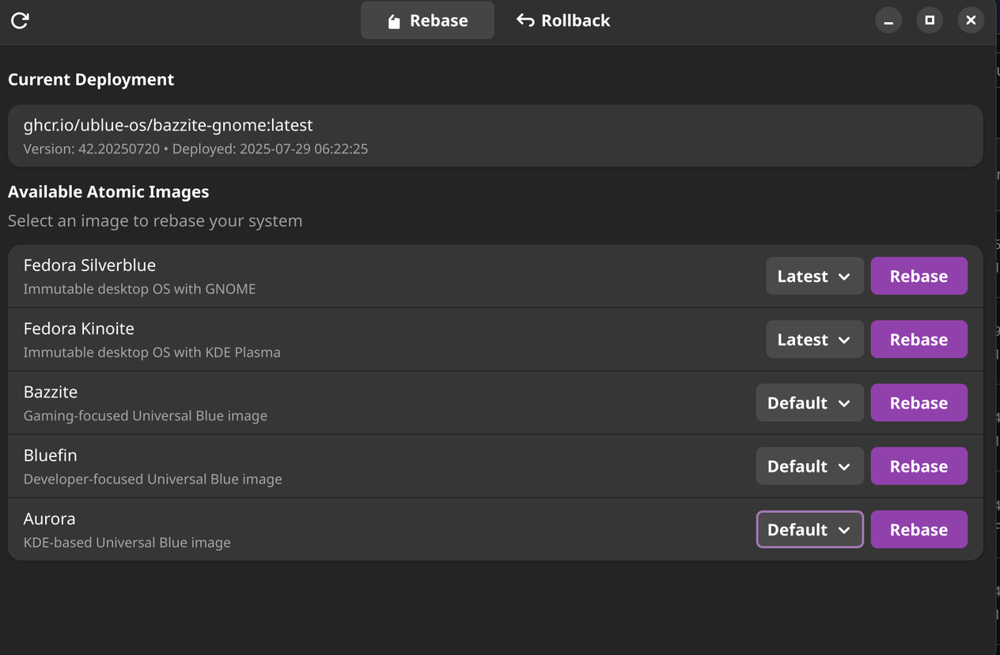

# Atomic Image Manager

A native GTK4/libadwaita application for managing atomic/ostree system deployments with full rpm-ostree integration. Allows easy rebasing between Fedora atomic variants (Silverblue, Kinoite) and Universal Blue images, with rollback to previous deployments.

## ✨ Features

### Core Functionality
- **Native GTK4 Interface** - Pure GTK4/libadwaita application (no WebKit dependencies)
- **Direct System Integration** - Full rpm-ostree integration via flatpak-spawn
- **Live Progress Tracking** - Real-time command output during rebase/rollback operations
- **Variant Selection** - Dropdown menus for all image variants
- **Full History** - Access to complete deployment history
- **Safe Operations** - Confirmation dialogs for all system modifications

### Supported Images & Variants

#### Fedora Atomic Desktops
- **Silverblue** - Immutable GNOME desktop
  - Latest, 40, 41, Rawhide versions
- **Kinoite** - Immutable KDE Plasma desktop  
  - Latest, 40, 41, Rawhide versions

#### Universal Blue Images
- **Bazzite** - Gaming-focused image
  - Default, GNOME, Deck, DX, NVIDIA, AMD variants
- **Bluefin** - Developer-focused image
  - Default, DX, NVIDIA, DX NVIDIA variants
- **Aurora** - KDE Plasma desktop
  - Default, DX, NVIDIA, DX NVIDIA variants

### Technical Features
- ✅ **Flatpak Sandboxing** - Proper isolation with host system access
- ✅ **Thread-Safe Updates** - All UI operations in main thread
- ✅ **Error Recovery** - Comprehensive error handling
- ✅ **GNOME 47 Runtime** - Latest GNOME platform
- ✅ **Full Container References** - Shows complete image URLs (e.g., `ghcr.io/ublue-os/bluefin-dx:latest`)

## 🛠️ Quick Start

### Prerequisites
```bash
# Install Flatpak and Flatpak Builder
sudo apt install flatpak flatpak-builder  # Ubuntu/Debian
sudo dnf install flatpak flatpak-builder  # Fedora

# Add Flathub repository
flatpak remote-add --if-not-exists flathub https://flathub.org/repo/flathub.flatpakrepo

# Install GNOME Runtime and SDK
flatpak install flathub org.gnome.Platform//47 org.gnome.Sdk//47
```

### Build and Install
```bash
# Clone the repository
git clone https://github.com/ULilBagel/ublue-rebase-tool.git
cd ublue-rebase-tool

# Build and install the Flatpak
flatpak run org.flatpak.Builder --force-clean --user --install --install-deps-from=flathub build-dir io.github.ublue.RebaseTool.json

# Run the application
flatpak run io.github.ublue.RebaseTool
```

### Alternative: Use Pre-built Release
```bash
# Download the latest release flatpak
wget https://github.com/ULilBagel/ublue-rebase-tool/releases/latest/download/io.github.ublue.RebaseTool.flatpak

# Install it
flatpak install --user io.github.ublue.RebaseTool.flatpak
```

## 📸 Screenshots


*Main application window showing current deployment and available images*


*Live progress tracking during rebase operation*

## 🏗️ Architecture

### Application Structure
```
src/
├── ublue-image-manager.py    # Main application entry point
├── command_executor.py       # Secure command execution service
├── deployment_manager.py     # rpm-ostree deployment parsing
├── rpm_ostree_helper.py      # Flatpak-spawn integration
├── history_manager.py        # Deployment history tracking
├── progress_tracker.py       # Operation progress monitoring
└── ui/                       # User interface components
    ├── simple_confirmation_dialog.py
    └── confirmation_dialog.py

data/
├── icons/                    # Application icons
├── metainfo/                # AppStream metadata
└── web/                     # Legacy web assets

io.github.ublue.RebaseTool.json  # Flatpak manifest
```

### Key Components

#### Command Execution
- **flatpak-spawn** - Executes rpm-ostree commands on host system
- **Thread-safe callbacks** - Progress updates in main GTK thread
- **Live output streaming** - Real-time command output display

#### Deployment Management
- **JSON parsing** - Parses rpm-ostree status output
- **Container references** - Extracts full image URLs
- **History tracking** - Maintains deployment history

#### User Interface
- **AdwApplicationWindow** - Main application window
- **AdwPreferencesGroup** - Settings and deployment groups
- **AdwToastOverlay** - User notifications
- **Gtk.TextView** - Live log output display

## 🔒 Security & Permissions

### Flatpak Permissions
```json
{
  "finish-args": [
    "--filesystem=/run/host/etc:ro",     // Read host OS information
    "--filesystem=host-os:ro",           // Read-only OS access
    "--talk-name=org.freedesktop.Flatpak", // Execute commands on host
    "--talk-name=org.freedesktop.PolicyKit1", // Authentication dialogs
    "--socket=wayland",                  // Wayland display
    "--socket=fallback-x11",            // X11 fallback
    "--device=dri"                      // GPU acceleration
  ]
}
```

### Security Features
- **Sandboxed Execution** - Runs in Flatpak sandbox
- **Host Isolation** - Uses flatpak-spawn for host commands
- **Read-Only Access** - No direct filesystem modifications
- **User Confirmation** - All operations require explicit confirmation

## 🧪 Usage

### Main Window
The main window displays your current deployment and provides two tabs:

1. **Rebase Tab**
   - Select from available Universal Blue images
   - Choose specific variants via dropdown
   - Click "Rebase" to switch images

2. **Rollback Tab**
   - View all available deployments
   - Shows full container references
   - Click "Rollback" on any previous deployment

### Progress Tracking
During rebase/rollback operations:
- Modal progress window appears
- Live command output displayed
- Progress bar shows operation status
- Window remains open after completion

## 🤝 Contributing

Contributions are welcome! Please:

1. Fork the repository
2. Create a feature branch
3. Make your changes
4. Test thoroughly
5. Submit a pull request

### Development Tips
```bash
# Run with debug output
RUST_LOG=debug flatpak run io.github.ublue.RebaseTool

# Test without rebuilding flatpak
python3 src/ublue-image-manager.py

# Monitor D-Bus activity
dbus-monitor --system "interface='org.projectatomic.rpmostree1'"
```

## 🐛 Troubleshooting

### Common Issues

**"Unsupported System" Error**
- Ensure you're running on an atomic/ostree system
- Check that rpm-ostree is available

**Operations Timing Out**
- Large images may take several minutes to download
- Check your internet connection
- Monitor progress in the log output

**Flatpak Errors**
- Ensure GNOME 47 runtime is installed
- Try `flatpak repair --user`

## 📄 License

GPL-3.0 - See [LICENSE](LICENSE) file for details

## 🙏 Acknowledgments

- [Universal Blue](https://universal-blue.org/) team for the amazing OS images
- [GNOME](https://gnome.org/) project for GTK4 and libadwaita
- [Flatpak](https://flatpak.org/) team for the packaging system

---

Built with ❤️ for the atomic desktop community
