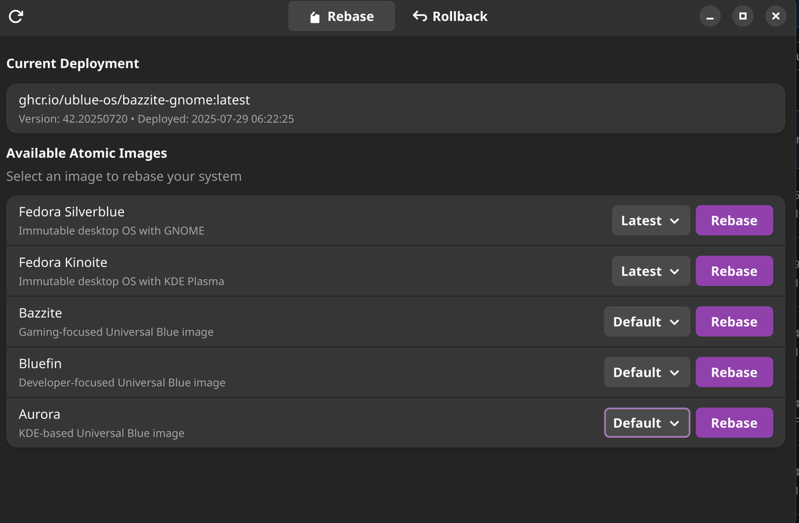

# Atomic Image Manager

A GTK4 application for managing atomic/ostree systems. Easily rebase between Fedora Silverblue, Kinoite, and Universal Blue images with live progress tracking.

## Features

- **Supported Systems**: 
  - Fedora Silverblue & Kinoite (versions 40, 41, Latest, Rawhide)
  - Universal Blue: Bazzite, Bluefin, Aurora (all variants)
- **Live Progress**: Real-time command output during operations
- **Safe Operations**: Confirmation dialogs and rollback capabilities
- **Native GTK4**: Modern libadwaita interface with variant selection

## Installation

### Option 1: Download Release
```bash
wget https://github.com/ULilBagel/ublue-rebase-tool/releases/latest/download/io.github.ublue.RebaseTool.flatpak
flatpak install --user io.github.ublue.RebaseTool.flatpak
```

### Option 2: Build from Source
```bash
# Prerequisites
flatpak install flathub org.gnome.Platform//47 org.gnome.Sdk//47

# Build
git clone https://github.com/ULilBagel/ublue-rebase-tool.git
cd ublue-rebase-tool
flatpak run org.flatpak.Builder --force-clean --user --install build-dir io.github.ublue.RebaseTool.json
```

## Usage

```bash
flatpak run io.github.ublue.RebaseTool
```

- **Rebase Tab**: Select an image and variant, click "Rebase"
- **Rollback Tab**: View deployment history, click "Rollback" on any previous deployment

## Screenshots




## Requirements

- Atomic/ostree-based system (Fedora Silverblue, Kinoite, or Universal Blue)
- Flatpak runtime
- GNOME 47 runtime

## Security & Permissions

The application runs sandboxed with minimal permissions:
- **Read-only access**: Host OS information and system files
- **D-Bus access**: rpm-ostree and Flatpak portals for system operations
- **Display access**: Wayland and X11 support
- **No network access**: Completely offline operation

Key permissions:
- `--filesystem=host-os:ro` - Read OS information
- `--talk-name=org.projectatomic.rpmostree1` - rpm-ostree operations
- `--talk-name=org.freedesktop.Flatpak` - Execute commands via flatpak-spawn

All system modifications require explicit user confirmation.

## License

GPL-3.0 - See [LICENSE](LICENSE) file for details

## Acknowledgments

- [Universal Blue](https://universal-blue.org/) team for the amazing OS images
- [Fedora Project](https://fedoraproject.org/) for Silverblue and Kinoite
- [GNOME](https://gnome.org/) project for GTK4 and libadwaita
- [Flatpak](https://flatpak.org/) team for the packaging system
